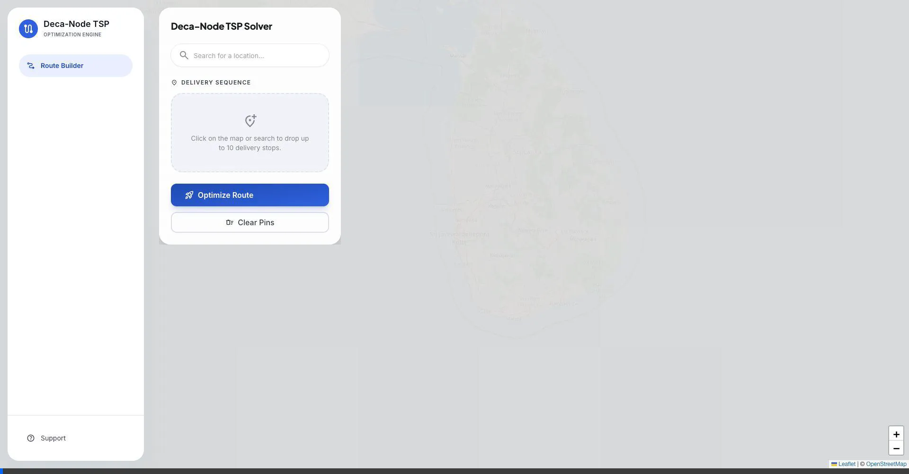

# Deca-Node -- Delivery Route Optimizer

A microservices-based delivery route optimization tool addressing the Traveling Salesperson Problem (TSP) using real-world map data.

## Architecture

```text
Browser (HTMX) ─→ Go Orchestrator (:8080) ─→ Java Routing Engine (:8081)
                   │  Smart Parsing              │  Geocoding (Photon)
                   │  HTML Fragments             │  Snap-to-Road (GraphHopper)
                   └──────────────────           │  Distance Matrix (GraphHopper)
                                                 │  TSP Solver (Jsprit)
                                                 └──────────────────────────
```

### System Components

*   **Frontend**: Leaflet.js with OpenStreetMap (OSM) tiles for interactive mapping.
*   **Orchestrator (Go)**: Go and HTMX manage API routing and client-side HTML fragment rendering.
*   **Routing Engine (Java/Spring Boot)**: Java was chosen primarily because the core routing libraries, GraphHopper and Jsprit, are written in Java.
*   **Containerization**: Docker Compose coordinates the microservices using multi-stage builds and internal bridge networks.

### Internal Data Flow

1.  User enters an address or clicks a map coordinate via the Leaflet interface.
2.  Frontend fetches geographic coordinates via the Photon (Komoot) Geocoding API if a text address is provided.
3.  Go Orchestrator parses the inputs and sends a JSON payload to the Java microservice.
4.  Java Routing Engine processes the sequence:
    *   GraphHopper maps exact coordinates to valid road network nodes (Snap-to-Road).
    *   GraphHopper computes the distance matrix.
    *   Jsprit resolves the Vehicle Routing Problem (VRP) to deduce the optimal sequence.
5.  Java returns the optimized coordinate sequence to Go.
6.  Go returns an HTMX out-of-band response containing JavaScript instructions to render the polyline onto Leaflet.js.

### OSM/GraphHopper vs. Google Maps API

The OSM/GraphHopper stack replaces commercial mapping APIs to:
*   Maintain data sovereignty over the routing graph.
*   Perform high-frequency NxN matrix calculations without API costs or rate limits.
*   Control the routing logic, edge weights, and algorithms without vendor reliance.

## Quick Start

### Live Demo



*The interactive visualization above demonstrates Deca-Node's 5-step routing pipeline. In this example, "Homagama", "Galle Fort", "Kiribathgoda", and "Colombo Lotus Tower" were sequentially entered into the search bar (resolved by Photon Geocoding). The GraphHopper engine computed the distance matrix after snapping the locations to the road network, and Jsprit mathematically calculated the optimal TSP delivery sequence. Finally, the Go orchestrator asynchronously returned the optimized polyline route directly to the interactive Leaflet map.*

### 1. Clone & Download OSM Data

```bash
git clone https://github.com/sethum-VS/Deca-Node-TSP.git
cd Deca-Node-TSP

# Download Sri Lanka OSM data (~150MB)
./init-data.sh
```

### 2. Build & Run

```bash
docker-compose up --build
```

> **Note:** On first startup, GraphHopper builds a routing graph from the PBF file automatically. This takes 30-60 seconds. Subsequent startups load from the cache.
> JVM constraints (`JAVA_TOOL_OPTIONS="-Xmx1G"`) are configured to limit memory usage.

### 3. Open the App

Navigate to [http://localhost:8080](http://localhost:8080)

Enter delivery stops as:
- Coordinates: `6.9271, 79.8612`
- Addresses: `Lotus Tower, Colombo`
- Map clicks

## Tech Stack

| Component | Technology |
|---|---|
| Frontend | HTMX, Tailwind CSS, Leaflet.js |
| Orchestrator | Go (1.26.1) `net/http`, `html/template` |
| Routing Engine | Java 21, Spring Boot 3.4 |
| Routing Graph | GraphHopper 11.0, Sri Lanka OSM |
| TSP Solver | jsprit 1.7.2 |
| Geocoding | Photon API (Komoot) |
| Infrastructure | Docker Compose |

## Development Roadmap

| Sprint | Objective |
| --- | --- |
| Sprint 1 | Repository Initialization, DDD Directory Skeleton, Go Orchestrator HTTP Setup |
| Sprint 2 | Java Microservice Initialization, Docker Network Integration |
| Sprint 3 | GraphHopper & Jsprit Integration, OSM Dataset Ingestion, 5-step Pipeline (Geocode, Snap, Matrix, Solve, Respond) |
| Sprint 4 | Leaflet Map Integration, Tailwind CSS UI, Map-based Pin Drops, Route Polylines |
| Sprint 5 | Production CI/CD to GCP — Cloud Run (WIF), Artifact Registry, Firebase Hosting |
| Sprint 6 | Pipeline Orchestration — Serialized deployments, VPC networking, Firebase routing fix |
| Sprint 7 | Road Network Geometry — Real road paths from GraphHopper replace straight-line polylines |

## Deployment & CI/CD

The project uses a two-tier GitHub Actions pipeline:

### CI — Branch Validation (`.github/workflows/ci.yml`)

Triggers on every push to feature branches and on pull requests targeting `main`. Validates:
- **Java**: Compiles the routing engine via `mvn clean package -DskipTests`
- **Go**: Builds all packages via `go build ./...` and runs `go vet`

> **Note:** Branch protection rules should be configured on `main` to require these status checks to pass before merging.

### Production — Deploy to GCP (`.github/workflows/deploy-production.yml`)

Triggers **only** on push to `main`. Deploys sequentially with `needs:` dependencies:

```text
deploy-java ──→ deploy-go ──→ deploy-firebase
  (Cloud Run)     (Cloud Run)    (Firebase Hosting)
```

- **Java Routing Engine**: Builds Docker image (with pre-baked GraphHopper cache), pushes to Artifact Registry, deploys to Cloud Run (internal ingress).
- **Go Orchestrator**: Builds Docker image, deploys to Cloud Run (public ingress, VPC egress to reach Java internally).
- **Firebase Hosting**: Deploys `firebase.json` rewrite rules to proxy all traffic to the Go Cloud Run service.

**Authentication**: Uses Workload Identity Federation (WIF) — no static JSON service account keys.

## Development

```bash
# Feature branch workflow
git checkout -b feature/my-feature

# Run services individually (without Docker)
cd go-orchestrator && go run cmd/server/main.go
cd java-routing-engine && mvn spring-boot:run
```

