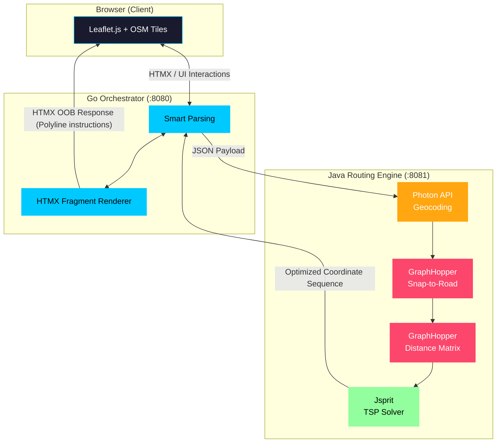

# Deca-Node — Delivery Route Optimizer

> A **microservices-based** delivery route optimization tool addressing the Traveling Salesperson Problem (TSP) using real-world map data to determine the most optimal and time-efficient sequence for multi-stop journeys.


*The interactive visualization above demonstrates Deca-Node's 5-step routing pipeline. In this example, "Homagama", "Galle Fort", "Kiribathgoda", and "Colombo Lotus Tower" were sequentially entered into the search bar (resolved by Photon Geocoding). The GraphHopper engine computed the distance matrix after snapping the locations to the road network, and Jsprit mathematically calculated the optimal TSP delivery sequence. Finally, the Go orchestrator asynchronously returned the optimized polyline route directly to the interactive Leaflet map.*

---

## Table of Contents

- [Tech Stack](#tech-stack)
- [Project Structure](#project-structure)
- [High-Level Architecture & Design Choices](#high-level-architecture--design-choices)
- [System Interconnectivity](#system-interconnectivity)
- [Deployment & CI/CD](#deployment--cicd)
- [Getting Started](#getting-started)
- [Development](#development)

---

## Tech Stack

| Layer | Technology |
|---|---|
| **UI / Frontend** | HTMX, Tailwind CSS, Leaflet.js |
| **Orchestrator** | Go (1.26.1) `net/http`, `html/template` |
| **Routing Engine** | Java 21, Spring Boot 3.4 |
| **Routing Graph** | GraphHopper 11.0, Sri Lanka OSM |
| **TSP Solver** | jsprit 1.7.2 |
| **Geocoding** | Photon API (Komoot) |
| **Infrastructure** | Docker Compose, GitHub Actions, Google Cloud Platform |

---

## Project Structure

```
Deca-Node-TSP/
├── go-orchestrator/            # Go service managing API routing and HTML fragments
│   └── cmd/server/main.go      # Go entry point
├── java-routing-engine/        # Spring Boot service handling heavy mathematical routing
│   └── pom.xml                 # Maven configuration
├── docs/
│   └── assets/                 # Documentation and demo media
├── .github/workflows/          # CI/CD pipelines (ci.yml, deploy-production.yml)
├── docker-compose.yml          # Container orchestration and internal bridge networks
└── init-data.sh                # Script to download required Sri Lanka OSM data
```

---

## High-Level Architecture & Design Choices

### Custom Routing Engine

This system employs a highly tuned custom engine model to determine the most optimal and time-efficient route for every destination, avoiding reliance on standard commercial APIs. 

*   **TSP Optimization:** It first solves the Traveling Salesperson Problem (TSP) mathematically to determine the absolute best sequence of delivery stops.
*   **Hierarchical Road Prioritization:** It calculates the physical route by utilizing Sri Lanka's graded road infrastructure, starting with expressways and cascading down to local roads.
*   **Time-Based Penalty Mechanism:** Instead of relying solely on the shortest physical distance, the system incorporates a custom priority penalty mechanism based on the highest speed limit of each road category (Expressways > A-Class > B-Class > Minor Roads).

This approach ensures the identification of the fastest possible route by actively favoring highways over shorter, congested local roads, achieving highly optimized logistics even without the use of real-time traffic data.

### OSM/GraphHopper vs. Google Maps API

The OSM/GraphHopper stack was explicitly chosen over commercial mapping APIs to:
*   Maintain total data sovereignty over the routing graph.
*   Perform high-frequency $N \times N$ matrix calculations without API costs or rate limits.
*   Retain absolute control over the routing logic, edge weights, and algorithms without vendor reliance. Java was chosen for the routing microservice specifically because the core libraries (GraphHopper and jsprit) are native to the JVM ecosystem.

---

## System Interconnectivity

The Deca-Node ecosystem utilizes a decoupled architecture where the Go Orchestrator acts as the middleman between the client interface and the Java-based heavy computation engine.



### Internal Data Flow

1.  User enters an address or clicks a map coordinate via the Leaflet interface.
2.  Frontend fetches geographic coordinates via the Photon (Komoot) Geocoding API if a text address is provided.
3.  Go Orchestrator parses the inputs and sends a JSON payload to the Java microservice.
4.  Java Routing Engine processes the sequence:
    *   GraphHopper maps exact coordinates to valid road network nodes.
    *   GraphHopper computes the distance matrix.
    *   Jsprit resolves the Vehicle Routing Problem (VRP).
5.  Java returns the optimized coordinate sequence to Go.
6.  Go returns an HTMX out-of-band response containing JavaScript instructions to render the polyline.

---

## Deployment & CI/CD

The project utilizes a two-tier GitHub Actions pipeline:

### CI — Branch Validation (`ci.yml`)
Triggers on every push to feature branches and on pull requests targeting `main`.
*   **Java:** Compiles the routing engine via `mvn clean package -DskipTests`.
*   **Go:** Builds all packages via `go build ./...` and runs `go vet`.

### Production — Deploy to GCP (`deploy-production.yml`)
Triggers **only** on push to `main`. Deploys sequentially with `needs:` dependencies. Authentication uses Workload Identity Federation (WIF) to avoid static JSON service account keys.

```text
deploy-java ──→ deploy-go ──→ deploy-firebase
  (Cloud Run)     (Cloud Run)    (Firebase Hosting)
```

1.  **Java Routing Engine:** Builds Docker image (with pre-baked GraphHopper cache), pushes to Artifact Registry, deploys to Cloud Run (internal ingress).
2.  **Go Orchestrator:** Builds Docker image, deploys to Cloud Run (public ingress, VPC egress to reach Java internally).
3.  **Firebase Hosting:** Deploys `firebase.json` rewrite rules to proxy all traffic to the Go Cloud Run service.

---

## Getting Started

### Prerequisites

*   Docker & Docker Compose
*   Git

### 1. Clone & Download OSM Data

```bash
git clone https://github.com/sethum-VS/Deca-Node-TSP.git
cd Deca-Node-TSP

# Download Sri Lanka OSM data (~150MB)
./init-data.sh
```

### 2. Build & Run

```bash
docker-compose up --build
```

> **Note:** On first startup, GraphHopper builds a routing graph from the PBF file automatically. This takes 30-60 seconds. Subsequent startups load from the cache. JVM constraints (`JAVA_TOOL_OPTIONS="-Xmx1G"`) are configured to limit memory usage.

### 3. Open the App

Navigate to [http://localhost:8080](http://localhost:8080)

Enter delivery stops as:
- Addresses: `Lotus Tower, Colombo`
- Direct Map clicks

---

## Development

If you prefer to run the services individually without Docker (e.g., on a feature branch):

```bash
# Feature branch workflow
git checkout -b feature/my-feature

# Run Go Orchestrator
cd go-orchestrator && go run cmd/server/main.go

# Run Java Routing Engine
cd java-routing-engine && mvn spring-boot:run
```
